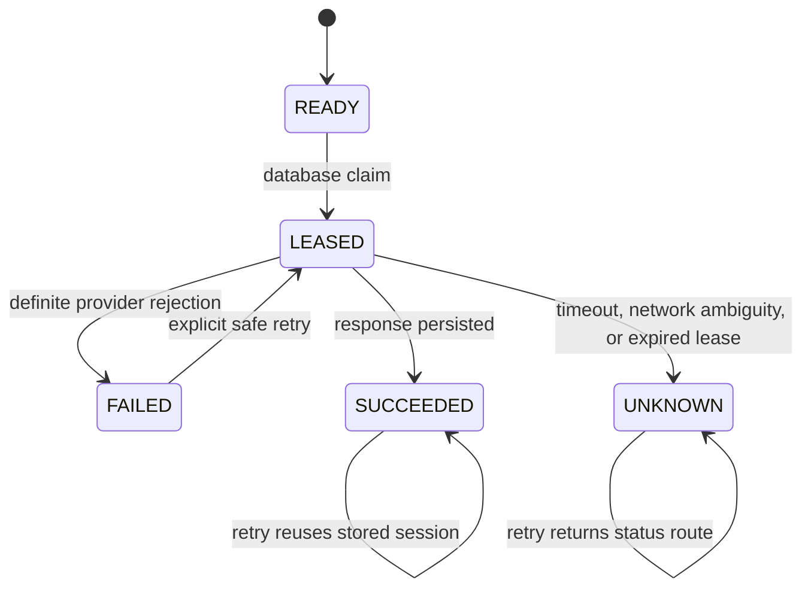

# Phase 4 — Durable checkout and provider initiation

Date: 8 September 2026. Scope stops at Phase 4. The audit baseline remains 43/100 and NO-GO until the later phases and external release gates are reassessed. Real payment credentials are unavailable by user instruction, so live PhonePe certification remains deferred.

## Root-cause evidence

The pre-change concurrency test launched two independent `CommerceService` instances against the same payment and delayed the provider response. Both instances called the provider. The database still contained one payment row, but that uniqueness did not protect the external side effect. Baseline evidence is retained in `run-1788844696689`: the test received two provider calls where one was required.

The cause was the initiation sequence: read `PENDING`, call the provider, then update the payment. The read and update did not create an exclusive durable owner, and the redirect response existed only in the responding process. A timeout or crash could therefore produce an unknown provider outcome followed by another external request.

## Implemented state machine

- Checkout creates the request hash, order, inventory reservations, payment, checkout association and `payment_initiations` row in one transaction.
- Initiation locks the payment row briefly, claims the durable initiation row with a random lease token, increments the attempt count and commits before making the HTTP request.
- The provider call runs without holding database locks. Its response is applied only when the same lease token still owns the row.
- A successful response persists the provider reference and redirect URL. Any process can return that same session on retry.
- A definite rejection becomes `FAILED` and permits a controlled new claim. Timeout, network ambiguity and lease expiry become `UNKNOWN`; retries do not issue another provider request. Phase 5 reconciliation owns resolution of unknown external outcomes.
- Concurrent callbacks or terminal payment transitions clear any lease and update the initiation state without reverting a newer payment result.

## Migration and compatibility

Migration `20260908110000_durable_payment_initiation` adds a one-to-one initiation record with a payment foreign key, lease coherence constraint, non-negative attempt constraint, and state/lease index. It does not rewrite an existing migration.

The migration backfills every existing payment. Pending payments become `READY`; terminal successful payments become `SUCCEEDED`; terminal unsuccessful payments become `FAILED`; legacy `INITIATED` payments without a persisted session become `UNKNOWN` so deployment cannot accidentally repeat an external charge request. The service also creates a missing initiation row lazily, which keeps mixed-version rollout compatible with an older application instance that creates a payment without the new relation.

The populated rehearsal deployed the baseline schema, inserted linked legacy commerce and authentication records, and then deployed all remaining migrations. All 14 migrations completed without rollback, repeat deployment had nothing pending, Prisma reported zero drift, and the legacy payment received the expected durable initiation backfill.

## Browser attempt ownership

The browser stores only an owner identifier, SHA-256 purchase fingerprint and idempotency key in session storage. The fingerprint covers the account, normalized address request, delivery option, coupon, sorted variants, quantities and reviewed paise prices. A refresh with the same confirmed purchase reuses the key. Any material purchase or account change creates a new key. Terminal payment completion and account transitions clear the attempt.

External HTTPS provider URLs continue through validated full-page navigation. The demo provider keeps its dedicated internal simulator route. Leased or unknown real-provider attempts use a separate payment-status page that polls the owned server record and cannot invoke demo controls.

## Verification

Final full-tree evidence: `C:/Users/ilesh/.codex/visualizations/2026/09/06/01a07702-324d-7621-ba86-b89066893a09/phase1/run-1788847038628/`.

Populated migration evidence: `C:/Users/ilesh/.codex/visualizations/2026/09/06/01a07702-324d-7621-ba86-b89066893a09/phase1/phase3-gates-1788846752534/`.

| Check | Result |
|---|---|
| Frozen install | PASS |
| Prisma validation/generation | PASS |
| Empty migration deployment/replay | PASS: 14 migrations |
| Populated legacy migration/backfill | PASS: 14 applied, 0 rolled back |
| Database-to-Prisma drift | PASS: zero difference |
| Typecheck and lint | PASS |
| Backend/frontend production builds | PASS |
| Compiled artifact smoke | PASS |
| Backend tests | PASS: 220 passed, 0 failed, 2 environment-dependent skips |
| Frontend tests | PASS: 74 passed, 0 failed |
| Chromium | PASS: 2 authenticated/session journeys |

Focused regression evidence proves one provider call under simultaneous initiation, persisted redirect reuse after a new service instance, committed checkout preservation after a lost response, no blind retry for unknown outcomes, safe retry after definite rejection, expired-lease quarantine, same-key browser recovery after refresh, new-key creation for a changed purchase, safe pending-status routing, and the existing checkout/callback/inventory suite.

## Remaining external evidence

- Live PhonePe initiation and hosted redirect navigation are not verified because no merchant account version or credentials are configured.
- Provider-specific recovery of an `UNKNOWN` initiation belongs to Phase 5 after the merchant status API contract is confirmed.
- External staging replay remains open until a staging API, dedicated staging database and shared Redis are provisioned.
- No shared database migration, deployment, commit or score increase was performed.

Phase 4 implementation and applicable local verification are complete. Live-provider and external staging certification remain deferred and must not be represented as passed.
