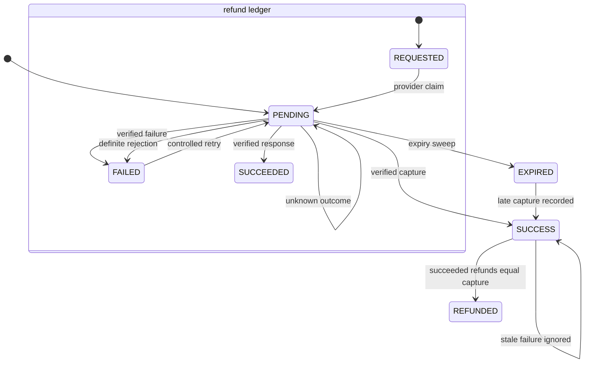

# Phase 5 verification: authoritative payments, reconciliation and refunds

Date: 8 September 2026

Scope: implement the provider-independent payment lifecycle and honest demo refund behavior. The merchant has no PhonePe credentials or provisioned API version, so live PhonePe request, callback, refund and settlement certification remains deferred.

## Root-cause findings

Payment completion, status polling, operator reconciliation, reservation expiry and admin return processing wrote payment status independently. The previous completion path also expected a successful order to remain `CONFIRMED`, so a duplicate success callback after shipment or delivery could be rejected. A late capture after expiry remained recorded as expired even though the provider held customer funds. Admin cancellation and return processing changed the payment directly to `REFUNDED` without a refund operation or durable financial record.

## Architectural remediation

- `applyPaymentObservation` is the single owner for terminal payment observations. It locks and reloads the payment, applies monotonic rules, preserves fulfillment progress and records each callback, poll, reconciliation, demo result or expiry in `payment_observations`.
- Provider status calls occur before the short database transaction. The fresh locked state is evaluated only after the external response is available.
- Signed callbacks require the payment amount, reject mismatched route/payment identifiers, validate configured merchant identity and deduplicate the signed response by hash.
- Capture is authoritative. Failure, cancellation or expiry cannot regress captured/refunded money. A late capture remains captured, leaves released inventory and cancelled fulfillment unchanged, and creates an idempotent full refund request.
- `payment_refunds` separates requested, pending, failed and succeeded refund state from order fulfillment. It records minor-unit amount, reason, mode, idempotency identity, provider reference, attempts, failure and processing timestamps.
- Refund totals serialize on the payment row, cannot exceed the capture, and only move a payment to `REFUNDED` when succeeded refunds equal the captured amount. Other captured payments on the same order are preserved when a duplicate capture is refunded.
- Demo mode produces an explicit `DEMO/SUCCEEDED` refund record. Live mode produces `LIVE/REQUESTED` and does not claim money moved. Legacy `REFUNDED` rows backfill as `UNKNOWN/LEGACY` because their original provider evidence cannot be reconstructed.
- Refund execution claims `PENDING` before provider I/O. Definite rejection becomes retryable `FAILED`; an unknown timeout remains `PENDING` and cannot be blindly submitted again. The admin processing route is available, while the PhonePe adapter intentionally has no refund operation until the merchant contract is known.
- Customer order responses include the refund ledger, and the order details page labels demo refund simulations.

## Migration and compatibility

Migration `20260908160000_authoritative_payment_refunds` is additive. It creates observation/refund enums, tables, constraints, foreign-key indexes and operational indexes. Existing `REFUNDED` payments receive a legacy ledger row without rewriting prior migrations. Old application readers can continue reading `payments` and `orders`; new writers add ledger rows. Rollback of application code leaves additive tables unused. Dropping financial ledger tables is a destructive contraction and is not part of this phase.

## Verification coverage

The Phase 5 integration suite covers duplicate success after shipment, stale failure after capture, expiry versus late capture, duplicate late capture, concurrent duplicate refund submission, partial then full refund aggregation, live requested semantics, provider reconciliation, definite refund rejection/retry and timeout suppression. Existing payment, inventory, callback, observability and launch consistency suites remain part of the full gate. Frontend mapper coverage verifies paise conversion and refund mode/status preservation.

Evidence snapshot: `C:/Users/ilesh/.codex/visualizations/2026/09/06/01a07702-324d-7621-ba86-b89066893a09/phase1/run-1788862555234/`.

All commands finished with exit code zero: frozen install; Prisma validation and generation; all 15 migrations on an empty database and repeat deployment; zero schema drift; seed; recursive typecheck and lint; both builds; compiled artifact smoke; backend tests; frontend tests; and authenticated Chromium. Backend: 227 passed, 0 failed, 2 intentionally skipped across 71 suites. Frontend: 74 passed, 0 failed across 38 suites. Playwright Chromium: 2 passed. `git diff --check` reported no whitespace errors; the displayed CRLF conversion notices are repository line-ending warnings.

## Deferred evidence

- Provisioned PhonePe API version, official authentication fields and exact callback signature contract: **Unknown / Not Verified**.
- PhonePe sandbox capture, refund, duplicate callback and settlement reconciliation: **Not Verified**; credentials are unavailable by user instruction.
- Provider-specific lookup of an unknown refund outcome: **Planned after the merchant refund/status contract is confirmed**.
- External multi-instance staging replay and operational alert delivery: **Not Verified** because no staging target is provisioned.

Phase 5 is locally complete for the configured demo product. Real-money production readiness remains blocked by these external gates.
